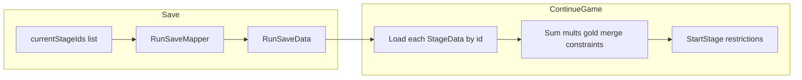

# 무한 모드 이중 스테이지 제한 + 저장 설계 플랜

## 목표 동작

- **무한 모드**에서만 스테이지 “제한”을 **2개** 뽑아 한 스테이지처럼 적용한다(기존 스토리/일반 런은 **제한 1개**).
- **비무한 모드**(스토리/일반 런)에서는 `StartStage` 등에 넘기는 `**List<StageData>`에 항목을 하나만** 넣고, `runData.currentStageIds`에도 **id 한 개**만 기록한다(3단계 이후에도 이 경로는 길이 1 유지).
- 수치: `baseScoreMultiplier`와 `additionalGold`는 제한 `StageData`들의 **합**(리스트가 항목 1개면 해당 SO의 값과 같다. 무한 모드에서는 항목 2개의 합).
- 제한 적용: `*currentStages` 제한마다 foreach**로 `StageData`를 순회하고, **각 SO 안에서는 기존과 동일**하게 `constraints` 리스트 **정의 순서대로** `EffectManager`에 추가한다(단일 SO 내부는 순서 의존). 제한 **끼리**의 효과가 순서 독립이면 이어하기 시 저장된 제한 id **집합**만 맞으면 복원하면 되고, 제한 간 foreach 순서는 요구하지 않아도 된다(기획이 허용할 때).
- **동종 조합 방지**: [StageData](c:\Projects\BlockBurst\Assets\Scripts\ScriptableData\StageData.cs)에 `constraintType` enum 필드를 두고, 조합 시 `constraintType`이 **서로 같으면** 제2 후보에서 제외한다. 순서 의존 문제는, 생기면 안 되는 쌍을 **같은 enum 값**을 배정해 런타임에서 절대 둘 다 뽑히지 않도록 할 것이므로 고려하지 않아도 된다.

## 데이터 모델

- **새 enum** (예: `ConstraintType`): [Enums.cs](c:\Projects\BlockBurst\Assets\Scripts\Enums.cs)에 두는 편이 `EffectType` 등과 일관적이다.
- `ConstraintType은 5가지로 구성된다. None, Reroll, Block, Gold, Board.`
- **StageData**: `public ConstraintType constraintType;` 추가. 기획값을 현재는 입력하지 않고 None으로 둔다.
- **RunData / RunSaveData**: `string currentStageId` → `*List<string> currentStageIds`* (이름은 프로젝트 스타일에 맞춰 `currentStageRestrictionIds` 등으로 해도 됨). `RunData.Initialize`에서 빈 리스트 준비.
- **세이브 버전**: 이전 세이브 버전이 배포된 적 없으므로 세이브 버전은 고려하지 않아도 된다.

> Unity [JsonUtility](c:\Projects\BlockBurst\Assets\Scripts\Data\DataManager.cs)는 이미 `RunSaveData`의 `List<string>` 필드를 쓰고 있으므로([RunData.json](c:\Projects\BlockBurst\Assets\Data\RunData.json)에 `availableBlockIds` 등), id 리스트 추가는 동일 패턴으로 맞추면 된다.

## 조합 로직(게임플레이)

- **게이트**: 무한 여부는 기존과 동일한 기준으로 단일화(예: `헬퍼 함수 IsInfiniteMode() => CLEAR_CHAPTER < 0을 두어 확인한다`). 이 플래그가 **true**일 때만 제한 2개 조합·합산·저장 id 2개. **false**일 때는 제한 **1개**만 쓰며, `StartStage`에 넘기는 리스트와 `currentStageIds` 모두 **길이 1**을 전제로 한다.
- **선택 UI**([GameManager.StartStageSelection](c:\Projects\BlockBurst\Assets\Scripts\Game\GameManager.cs)): 지금은 카드별로 단일 `StageData`에서 `choiceDebuffNames`를 만든다. 무한 모드에서는 카드마다 **두 제한**을 뽑은 뒤, UI용 이름 배열은 두 제한의 `constraints`를 합쳐 표시하면 되고, **표시 순서는 임의·정렬 등 가독성 위주**로 해도 된다(게임플레이는 순서 무관).
- **뽑기 알고리즘**: 첫 제한 후보 랜덤 → 둘째 후보는 `type`·무한 풀 필터 후 `*constraintType`이 첫 제한과 다름**인 것만. 실패 시(후보 없음) 첫 제한 리롤 또는 안전한 폴백 정책을 한 줄로 정해 둔다. None은 모든 Type과 호한되므로 필터하지 않는다.
- **BOSS 스테이지**: [GameManager.EndStage](c:\Projects\BlockBurst\Assets\Scripts\Game\GameManager.cs)의 `stageManager.currentStage.type == StageType.BOSS`는 **리스트화** 후 “**두 제한의 타입이 같은지 검사하고 같다면 BOSS인지 검사한다. 만약 같지 않다면 LogError를 출력한다.**

## StageManager / RunData / 이어하기

- [StageManager](c:\Projects\BlockBurst\Assets\Scripts\Run\StageManager.cs): `StageData currentStage` → `*List<StageData> currentStages`*. `StartStage`는 **제한 리스트**를 받도록 바꾸고, `ApplyConstraints`는 **바깥**: `currentStages` foreach, **안쪽**: 각 제한의 `constraints`를 **지금 코드와 같은 방식**(리스트 순서대로 `AddEffect`)으로 유지. **비무한 모드**에서는 호출부가 리스트에 `**StageData` 하나만** 담아 넘긴다.
- [GameManager.StartStage](c:\Projects\BlockBurst\Assets\Scripts\Game\GameManager.cs): 합산된 `clearRequirement` / `goldReward` 계산 후 `blockGame`에 설정; `runData.currentStageIds`에 참여 제한 id를 저장(비무한이면 **id 1개**, 무한이면 2개. JSON 리스트 순서는 **식별용**이며, 이어하기 시 제한 복원에는 순서를 요구하지 않음); `SaveRunData` 호출 유지.
- [GameManager.ContinueGame](c:\Projects\BlockBurst\Assets\Scripts\Game\GameManager.cs): `currentStageIds`가 비어 있지 않은지 검사 → 각 id에 대해 `TryGetStage` → **동일 합성 규칙**으로 `StartStage` 재진입; UI debuff 이름도 **합쳐진 constraints**에서 생성(현재는 단일 `resumeStage.constraints`만 사용).

## UI·부가 영향

- **플레이 중/선택 카드**는 이미 `string[]` 기반이라 이중 제한 표시는 큰 구조 변경 없이 가능([StageInfoUI](c:\Projects\BlockBurst\Assets\Scripts\UI\InGame\StageInfoUI.cs), [NextStageChoiceUI](c:\Projects\BlockBurst\Assets\Scripts\UI\InGame\NextStageChoiceUI.cs)).
- **grep으로 `currentStageId` 전부** 교체: 특히 [RunSaveMapper](c:\Projects\BlockBurst\Assets\Scripts\Data\RunSaveMapper.cs) `ToSaveData` / `FromSaveData`와 `ContinueGame` 검증.

## constraintType 설계 메모(요청 반영)

- 한 SO 안의 여러 `EffectData` 적용 기존 방식을 따른다. **(기존** `ApplyConstraints`**와 동일) 여러 제한 SO는** `*currentStages` **foreach**로 돌린다.

## 구현 단계(단계별)

단계는 **이전 단계가 깨지지 않게** 쌓는 순서다. 각 단계 끝에서 새 런/이어하기/스테이지 선택 한 사이클을 돌려보면 좋다.

### 1단계 — 데이터·저장 기반(완료)

- `ConstraintType` enum 추가, `StageData`에 `constraintType` 필드 추가.
- `RunData` / `RunSaveData`: `currentStageId` → `List<string> currentStageIds`(이름 확정), `RunData.Initialize`에서 리스트 초기화.
- `RunSaveMapper` ToSaveData / FromSaveData 양방향 매핑.
- 비무한 경로에서는 매 스테이지 시작 시 `**currentStageIds`에 id 한 개만** 반영하는 규칙이 저장·매핑과 함께 반영됨.

### 2단계 — 제한 리스트 파이프라인(스토리·무한 공통 골격)(완료)

- `StageManager`: `currentStage` → `currentStages`, `StartStage`가 제한 리스트 수신, `ApplyConstraints`는 foreach + 각 제한 `constraints`는 **ApplyConstraint 활용**.
- `GameManager.StartStage`: 합산 규칙 — `baseScoreMultiplier`·`additionalGold`는 제한들의 **합**; `별도의 헬퍼 함수를 두지 않고 직접 구함.`
- `OnStageSelection` / 플레이 진입: **비무한 모드**에서는 `StartStage` 등에 넘기는 리스트에 `**StageData` 1개만** 포함하고, `runData.currentStageIds`에 반영·저장(무한 모드에서 제한 2개는 3단계에서 연결).
- `EndStage`의 BOSS 판정은 이 플랜의 조합 로직 참고하여 깨지지 않게 연결.

### 3단계 — 무한 모드 이중 뽑기·필터·선택 UI

- **비무한 경로**는 계속 `List<StageData>`·`currentStageIds` **길이 1**을 유지하고, 이 단계에서는 **무한 모드**에서만 리스트에 제한 2개를 넣는 흐름을 완성한다.
- 무한 게이트(`CLEAR_CHAPTER` / 챕터 인덱스 등) **한 곳**에서 “제한 2개 모드” 분기.
- `StartStageSelection`: 카드마다 제한 2개 뽑기, 둘째는 `*constraintType` ≠ 첫째** 후보만; 실패 시 첫째 리롤 등 폴백.
- `choiceDebuffNames`·목표·보상은 **합성 결과**로 계산해 `StageSelectionBoardUI`에 전달.
- 필요 시 스테이지 템플릿 풀을 무한 전용으로 나누는지 여부만 이단계에서 맞춘다.
- 무한모드 시작 챕터를 4챕터에서 5챕터로 수정한다.

### 4단계 — 이어하기·BOSS·코드 정리

- `ContinueGame`: `currentStageIds` 전부 `TryGetStage` 후 2단계와 동일 합성으로 `StartStage` 재진입, UI debuff는 **모든 제한의 constraints**에서 수집.
- `EndStage` 이 플랜의 조합 로직 참고하여 BOSS·챕터 진행 규칙 **최종 확정**.
- 코드베이스에서 `currentStageId` 단일 필드 참조 제거·리스트 only.

### 5단계 — 기획·UI·튜토리얼·검증

- 무한 풀 `StageData`에 `constraintType` 배정.
- `StageInfoUI` / `NextStageChoiceUI`에서 이중 제한 표기·줄바꿈 가독성 확인.
- [StageManager](Assets/Scripts/Run/StageManager.cs)의 `**firstStageList` 관련 구현**도 제한 리스트·이중 제한 설계에 맞게 수정한다(예외 경로에서 단일 `StageData` 가정이 남아 있으면 함께 정리).
- `TutorialManager`·`firstStageList` 등 예외 경로 스모크.

## 작업 순서 제안(레거시 한 줄 요약)

1~2단계(완료): 저장·리스트 API·비무한 시 항목 1개 전달 골격 → 3단계: 무한만 제한 2개 → 4단계: 이어하기·정리 → 5단계: 기획·QA 순으로 진행하면 된다.

---

**플랜 정리 시 유의**: 워크스페이스가 `BlockBlock`인 경우 구현 파일은 동일 상대 경로 `Assets/Scripts/...` 아래에 대응한다(예: `RunSaveData.cs`, `RunSaveMapper.cs`, `GameManager.cs`, `RunData.cs`의 `currentStageId` 등).